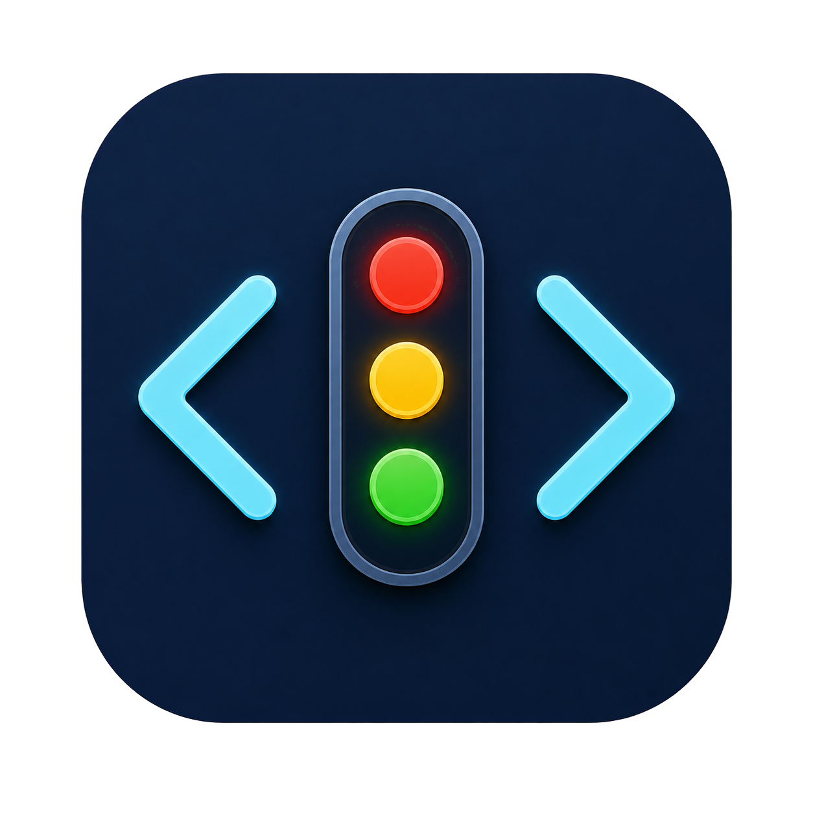

<p align="center">
  
</p>

<p align="center">
  <strong>简体中文</strong> | <a href="README_EN.md">English</a>
</p>

<h1 align="center">AI 工作状态指示灯</h1>

<p align="center">
  使用 ESP32-C3 的红、黄、绿 LED，实时显示 Codex 或 Cursor 的工作状态。
</p>

<p align="center">
  <a href="https://github.com/carlbuu/ai-status-light-esp32/actions/workflows/build-release.yml"></a>
  <a href="LICENSE"></a>
</p>

Windows 桥接程序通过 Codex 或 Cursor Hooks 获取任务状态，经 USB 串口控制 ESP32-C3。界面一次只启用一个 AI 平台，避免两个平台同时控制灯光。

## 功能特性

- 显示工作中、等待允许、完成待查看、错误和休眠状态。
- 可按并行任务数量让黄灯常亮、双闪或三闪。
- 支持 5%～100% 亮度调节、自动连接、开机启动和系统托盘。
- 支持 Codex 与 Cursor 安全切换，保留用户已有的其他 Hooks。
- Windows 端可作为单文件程序运行，也可使用便携安装包。

## 环境要求

- Windows 10 或 Windows 11
- ESP32-C3 开发板
- 红、黄、绿 LED 各一个及相应限流电阻
- 支持数据传输的 USB 线
- Arduino IDE（仅烧录固件时需要）
- Codex 或 Cursor

## 下载

推荐从 [GitHub Releases](https://github.com/carlbuu/ai-status-light-esp32/releases/latest) 下载：

- `CodexStatusLight-OneClick.exe`：单文件图形版，适合大多数用户。
- `CodexStatusLight-portable.zip`：包含程序及安装、卸载脚本。

从源码构建的文件不会提交到 Git 仓库中。

## 快速开始

1. 在 Arduino IDE 中打开并烧录 [`sketch_jul16a/sketch_jul16a.ino`](sketch_jul16a/sketch_jul16a.ino)。
2. 烧录前将 **USB CDC On Boot** 设置为 **Enabled**。
3. 按下表接好 LED，并关闭 Arduino IDE 的串口监视器。
4. 下载并运行 `CodexStatusLight-OneClick.exe`。
5. 选择 Codex 或 Cursor，点击“应用并配置”。
6. 完全退出并重新打开所选平台，使 Hooks 生效。
7. 在“设备连接”中连接 ESP32-C3，并用“灯光测试”确认接线。

| LED | ESP32-C3 引脚 | 有效电平 |
| --- | --- | --- |
| 红灯 | GPIO2 | 高电平 |
| 黄灯 | GPIO3 | 高电平 |
| 绿灯 | GPIO4 | 高电平 |

每路 LED 都应串联与器件匹配的限流电阻，并与 ESP32-C3 共地。

## 灯光速查

| 状态 | 灯光 |
| --- | --- |
| 任务运行中，任务数量动画关闭 | 黄灯常亮 |
| 1 个任务运行中，任务数量动画开启 | 黄灯常亮 |
| 2 个任务运行中，任务数量动画开启 | 黄灯双闪 |
| 3 个及以上任务运行中，任务数量动画开启 | 黄灯三闪 |
| 任一任务等待用户允许 | 绿灯闪烁 |
| 有已完成但尚未查看的项目 | 绿灯常亮 |
| 没有运行或待查看项目 | 自动熄灭 |
| 报错、断线或心跳超时 | 红灯常亮 |
| 电脑休眠或手动关闭显示 | 全部熄灭 |

状态优先级、平台差异和界面操作见[使用指南](docs/user-guide.md)。

## 文档

- [安装、接线与卸载](docs/installation.md)
- [使用指南](docs/user-guide.md)
- [故障排查](docs/troubleshooting.md)
- [架构与协议](docs/architecture.md)
- [开发、构建与发布](docs/development.md)
- [参与贡献](CONTRIBUTING.md)

## 构建

在项目根目录运行：

```powershell
powershell.exe -NoProfile -ExecutionPolicy Bypass -File .\windows\build.ps1
```

脚本会编译 Windows 程序、生成两种分发包并运行内置自检。详细说明见[开发文档](docs/development.md)。

## 重要说明

- 程序会修改所选平台的用户级 Hooks 配置；修改前会生成带时间戳的备份，并保留不属于本程序的 Hooks。
- Cursor 模式为了准确显示“等待允许”，会让 Shell、MCP、网页搜索和网页读取操作弹出权限提示。切回 Codex 后会移除这些 Hooks。
- 配置和日志保存在 `%LOCALAPPDATA%\CodexStatusLight`。

## 许可证

本项目采用 [MIT License](LICENSE)。

